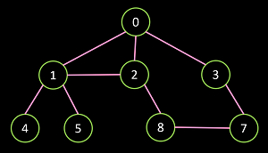

# Nome do projeto: Algoritmos em Grafos
Projeto para criar um conjunto de classes representando um grafo básico e seus métodos.

## Correção e comentários

### Nota: 17,1

Grafo de teste

---

- Sem documentação do projeto aqui nesta página (eu que escrevi)
- "Tamanho" está pegando vértices pelo for, em lugar de procurar pela lista de vizinhos (se pular id, dá errado.). Causa erro no subgrafo.
- BFS adiciona aresta sempre para o vértice inicial, não para o 'pai'
- DFS entra em loop infinito na chamada recursiva

---

- Aderência às classes do diagrama: 2/2 pontos
- Requisitos de grafos corretamente implementados: 9,3/12 pontos
  - Carregar/salvar		2/2 pontos
  - Grafo completo e subgrafo 2,7/3 pontos
  - Grafo direcionado/não direcionado 2/2 pontos
  - Busca em largura e profundidade 1,6/4 pontos
  - App para uso 1/1 ponto
- Documentação de código: 3,8/4 pontos
  - atenção para parâmetros, principalmente em construtores (mas teve outros também)
- Testes (quantidade e qualidade): 2/2 pontos

## Alunos integrantes da equipe

* Arthur Jansen Oliveira
* Bárbara Mattioly Andrade 
* Gabriel Pimentel Tabatinga
* Henrique Grissi C Soeiro de Carvalho
* Laura Enísia Rodrigues Melo

## Professores responsáveis

* João Caram Santos de Oliveira

